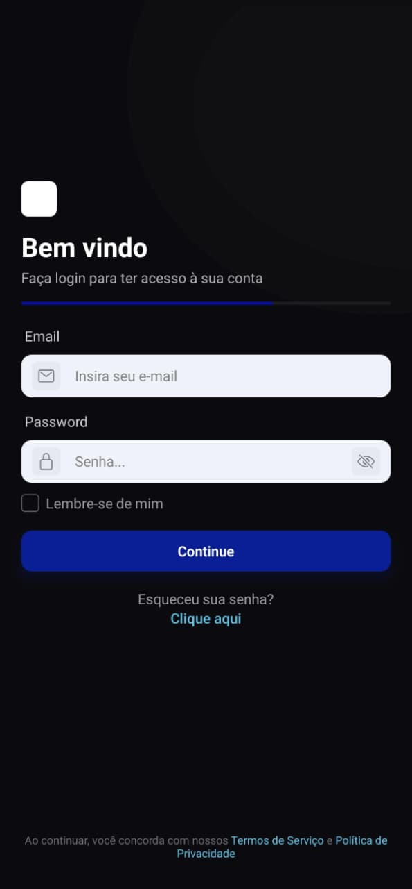
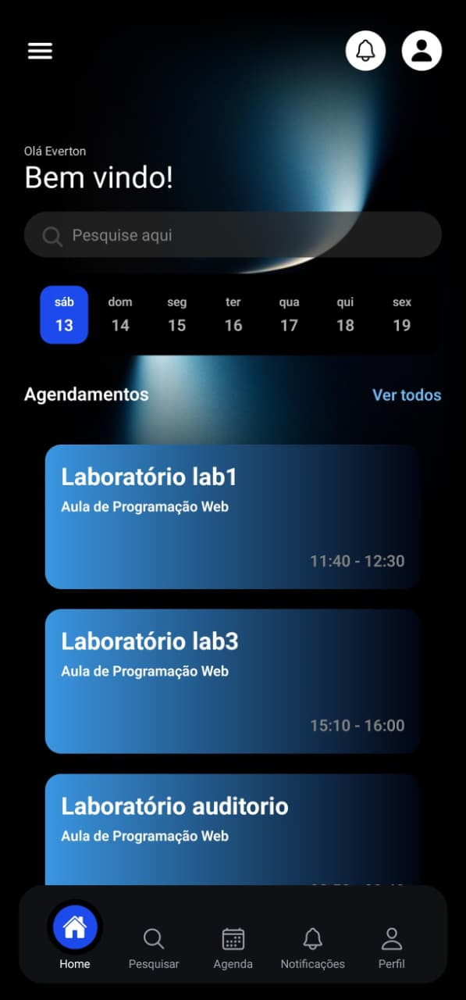
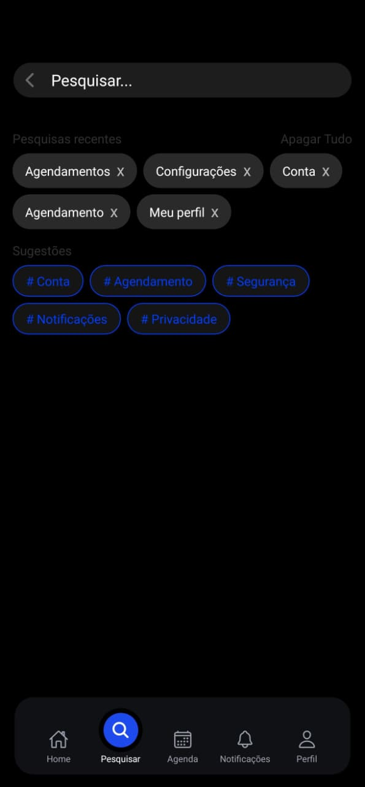
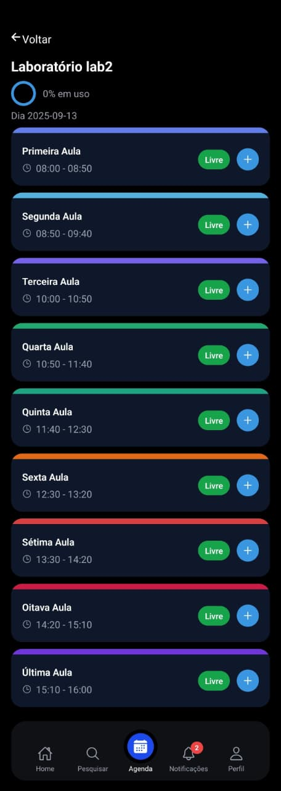
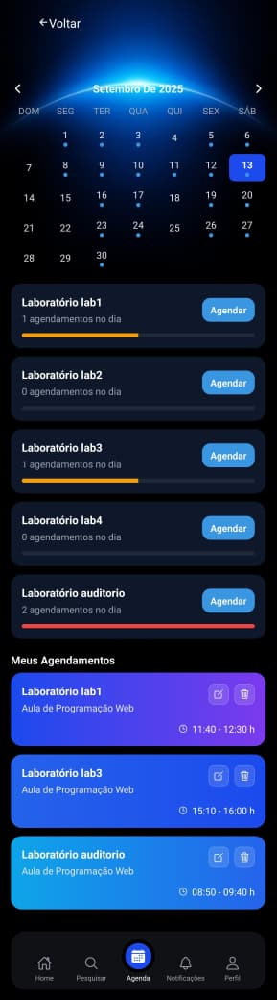
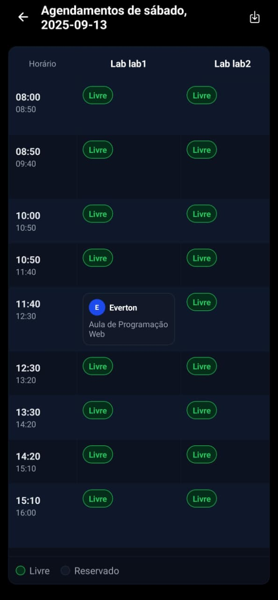
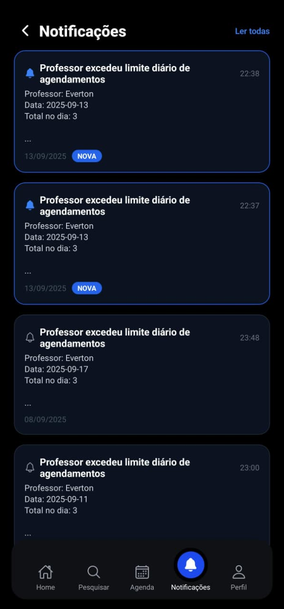
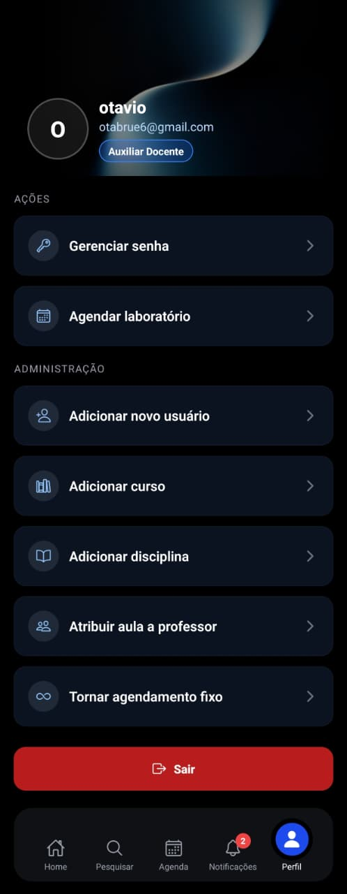

<p align="center">
  
</p>
<h1 align="center">LabControl</h1>
<p align="center"><em>Gestão de Laboratórios e Agendamentos</em></p>

> Sistema de gestão e agendamento de Laboratórios de Informática da **Etec de Peruíbe** desenvolvido pela turma do 2DS de 2025.

## 🎯 Visão Geral
O **LabControl** facilita o controle de uso dos laboratórios (e auditório) por Professores, Coordenadores e Auxiliares Docentes. O sistema oferece:
- Agendamentos com validações de conflito e regras de negócio.
- Horários Fixos (recorrentes) versus reservas pontuais.
- Notificações automáticas de uso excessivo.
- Limites de agendamento (futuro e por volume).
- Associação Professor ⇄ Disciplinas.
- Interface mobile (Expo/React Native) rápida, responsiva e com feedback visual.

## 🖼️ Preview das Telas
<p align="center">Capturas reais do app (diretório <code>/preview</code>).</p>

<div align="center">

<table>
<tr>
  <td><strong>Login</strong></td>
  <td><strong>Home</strong></td>
  <td><strong>Buscar</strong></td>
  <td><strong>Agendar</strong></td>
</tr>
<tr>
  <td></td>
  <td></td>
  <td></td>
  <td></td>
</tr>
<tr>
  <td><strong>Agendamentos Dia</strong></td>
  <td><strong>Horários Fixos</strong></td>
  <td><strong>Notificações</strong></td>
  <td><strong>Perfil</strong></td>
</tr>
<tr>
  <td></td>
  <td></td>
  <td></td>
  <td></td>
</tr>
</table>

</div>

## 👥 Perfis de Usuário
| Cargo | Pode Agendar | Converte p/ Horário Fixo | Recebe Notificação Diário | Recebe Notificação Semanal | Gerencia Disciplinas |
|-------|--------------|--------------------------|---------------------------|----------------------------|----------------------|
| Professor | Para sim | Não | Não (avisos vão para Auxiliar) | Sim | Não |
| Auxiliar_Docente | Para Professores | Sim | Sim (sobre Professores) | Não | Parcial (consultas) |
| Coordenador | Para Professores | Sim | Sim | Não | Sim |

## ✅ Principais Funcionalidades
- 🔐 Autenticação JWT + controle de cargo.
- 🧪 Validação forte de conflito (laboratório, dia e horário únicos).
- 📅 Agendamentos com horários permitidos (faixas pré-definidas de aula).
- ♻️ Horários Fixos (repetem semanalmente) coexistem com reservas normais.
- 📝 Justificativa obrigatória em todos os agendamentos.
- ⏳ Limite: Professores só podem agendar até **14 dias**.
- ⚠️ Notificação diária: ≥3 reservas no mesmo dia (envia/atualiza para Auxiliar).
- 📈 Notificação semanal: ≥7 reservas em 7 dias (Professor recebe/atualiza).
- 🔔 Tela de notificações + badge.
- 📊 Indicador de ocupação do laboratório.
- 🧩 Vínculo Professor ⇄ Disciplina obrigatório para agendar disciplina.

## 🏗️ Arquitetura
```
root
 ├─ backend
 │   ├─ src/controllers
 │   ├─ src/routes
 │   ├─ src/middleware
 │   ├─ src/database
 │   └─ src/models
 └─ frontend
     ├─ app
     ├─ components
     ├─ hooks
     └─ assets/images
```

### Fluxo Principal (Agendamento)
1. Abre laboratório + data.
2. Carrega reservas + horários fixos.
3. Seleciona slot livre.
4. Preenche disciplina (opcional se admin, valida vínculo se professor) + justificativa.
5. Backend valida regras.
6. Cria reserva → avalia notificações → frontend mostra toast.

## 🧠 Regras de Negócio (Resumo)
| Regra | Descrição |
|-------|-----------|
| Horários permitidos | Lista fixa (08:00…15:10). |
| Justificativa | Obrigatória sempre. |
| Limite 14 dias | Apenas Professores. |
| Conflito | Lab+dia+horário exclusivo. |
| Disciplina | Professor deve ter vínculo. |
| Notificação diária | ≥3 reservas (Auxiliar). |
| Notificação semanal | ≥7 em 7 dias (Professor). |
| Horário fixo | Criado a partir de reserva existente (Admin). |

## 🔔 Notificações
Tipos: `LIMITE_AGENDAMENTOS`, `LIMITE_SEMANAL_AGENDAMENTOS` (atualização em vez de duplicação).

## 📡 Rotas Principais
| Método | Rota | Descrição |
|--------|------|----------|
| POST | /auth/login | Login. |
| GET | /labs/all | Labs. |
| GET | /agendamentos/all | Reservas. |
| POST | /agendamentos/new | Nova reserva. |
| DELETE | /agendamentos/:id | Remove. |
| PUT | /agendamentos/:id | Edita. |
| POST | /agendamentos/:id/transformar-fixo | Reserva → fixo. |
| GET | /horarios-fixos/ | Fixos. |
| GET | /notificacoes | Lista notificações. |
| POST | /notificacoes/ler/:id | Marca lida. |
| POST | /notificacoes/ler-todas | Marca todas. |

## 🚀 Execução Rápida
Backend:
```bash
cd backend
npm install
mysql -u root -p < ../DB_Lab_Control.sql
npm run dev
```
Frontend:
```bash
cd frontend
npm install
npx expo start
```

## 🧪 Testes Manuais
1. Criar 3 reservas no mesmo dia (Professor) → notificação para Auxiliar.
2. Total 7 reservas em janela de 7 dias → notificação semanal no Professor.
3. Tentar duplicar slot → erro 409.
4. Tentar sem justificativa → erro 400.
5. Tentar >14 dias → erro 400.

## 🗺️ Roadmap
- Endpoint contagem rápida de notificações.
- Migrações estruturadas.
- Relatórios PDF/CSV.
- Testes automatizados.

---
Feito com 💙 pela turma do 2DS 2025 da Etec de Peruíbe.
